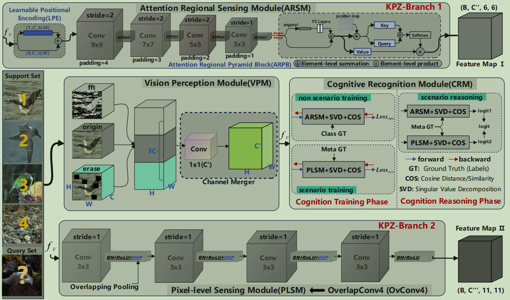

# Advancing Fine-Grained Few-Shot Learning via Human-Centric Visual Cognition


This package includes our codes for implementing "MindfulVision: Few-Shot Learning through Human-Centric Visual Cognition". 
(First Release Date: 2024-8-8)

# Introduction

*For the scarcity of samples and corresponding labels significantly increases few-shot learning difficulty, meta-learning is an effective strategy to address such tasks, aiming to achieve performance comparable to that of humans in few-shot learning scenarios. However the human visual system is incredibly complex, and traditional meta-learning approaches are somewhat superficial and do not truly capture human-centric visual cognition. Inspired by the biological structure and characteristics of human visual system, we propose the Human-Centric Visual Cognition Recognition Networks (VCRNets) in this paper, which include the shallower VCRNet-4 and the deeper
VCRNet-12. In the VCRNets, we introduce several modules to simulate different components of visual system: the Vision Perception Module (VPM) to mimic the visual pathway, the Attentional Regional Sensing Module (ARSM) and the Pixel-Level Sensing Module (PLSM) to emulate the regional and detail sensing functions of the occipital lobe, and the Cognitive Recognition Module (CRM) to simulate the integrative cognition of the frontal lobe. The primary difference between VCRNet-4 and VCRNet-12 lies in the PLSM, where we employ the Conv4 and ResNet-12 as baselines, respectively, and construct OvConv4 and OvResNet12 by employing Overlapping Pooling to more effectively extract pixel-level features. We evaluated our approach on three representative few-shot fine-grained image recognition benchmarks: CUB-200-2011,
Aircraft-Fewshot, and Stanford-Cars. Extensive comparative and ablation experiments demonstrate the superiority of our algorithms and the effectiveness of our network architectures.*
<p align="center"></p>

# Fine-grained Few-shot Datasets Preparation   
benchmarks
```
 materials
├── aircraft-fs
│   ├── aircraft-fs_test.pickle
│   ├── aircraft-fs_train.pickle
│   ├── aircraft-fs_val.pickle
├── cub-cropped
│   ├── cub-cropped_test.pickle
│   ├── cub-cropped_train.pickle
│   ├── cub-cropped_val.pickle
├── stanford-car
│   ├── stanford-car_test.pickle
│   ├── stanford-car_train.pickle
│   ├── stanford-car_val.pickle
```


# Non-scenario-training & scenario-training, and scenario-testing for Our VCRNets

Train
The following commands provide an example to train our VCRNets.
```bash
# Usage: bash ./scripts/train.sh [Dataset (aircraft-fs, stanford-car, cub-cropped)] [Encoder] [GPU index] [Tag]
bash ./scripts/train.sh stanford-car vcnet4 0 trial1
bash ./scripts/train.sh stanford-car vcnet12 0 trial1

```

Evaluate
The following commands provide an example to evaluate the checkpoint after training.
```bash
# Usage: bash ./scripts/test.sh  [Dataset (aircraft-fs, stanford-car, cub-cropped)] [Encoder] [GPU index] [Tag]
bash ./scripts/test.sh  stanford-car vcnet4 0 trial1
bash ./scripts/test.sh  stanford-car vcnet12 0 trial1
```


# Fine-Grained Few-shot Classification(5way-1shot, -5shot)
*We report the Experimental results (VCRNet-4 and VCRNet-12) on CUB-200-2011, Aircraft-fewshot, and StanfordCars benchmarks. We conducted three times 1,000 randomly sampled episodes experiments, and report average results for both 1-shot and 5-shot evaluation. More details on the experiments can be seen in the paper.*


### Ⅰ. CUB-200-2011
<table>
         <tr>
             <th rowspan="2" style="text-align:center;">Method(Ours)</th>
             <th colspan="4" style="text-align:center;">5-way-1-shot</th>
             <th colspan="4" style="text-align:center;">5-way-5-shot</th>
         </tr>
         <tr>
             <th colspan="1" style="text-align:center;">Backbone</th>
             <th colspan="1" style="text-align:center;">Pred. Accuracy</th>
             <th colspan="1" style="text-align:center;">Pretrained model</th>
             <th colspan="1" style="text-align:center;">Meta-testing-phase</th>
             <th colspan="1" style="text-align:center;">Backbone</th>
             <th colspan="1" style="text-align:center;">Pred. Accuracy</th>
             <th colspan="1" style="text-align:center;">Pretrained model</th>
             <th colspan="1" style="text-align:center;">Meta-testing-phase</th>
         </tr>
         <tr>
             <td style="text-align:center">VCRNet-4</td>
             <td style="text-align:center">Conv4</td>
             <td style="text-align:center;"> 80.30±0.23 </td>
             <td style="text-align:center;"><a href="https://drive.google.com/drive/folders/1ygWhQScM025txnI7GDwRoWzpKWtkWUI6?usp=drive_link">Download</a></td>
             <td style="text-align:center;"><a href="https://drive.google.com/file/d/1gcMXajfecxjwwgP7As5KupjF5XQwUxNU/view?usp=drive_link">Test Process GIF</a></td>
             <td style="text-align:center">Conv4</td>
             <td style="text-align:center;"> 90.99±0.12 </td>
             <td style="text-align:center;"><a href="https://drive.google.com/drive/folders/1ygWhQScM025txnI7GDwRoWzpKWtkWUI6?usp=drive_link">Download</a></td>
             <td style="text-align:center;"><a href="https://drive.google.com/file/d/184sFU0qLnYp8kZDzL-FVTnYADPQDAsCq/view?usp=drive_link">Test Process GIF</a></td>
         </tr>
         <tr>
             <td style="text-align:center">VCRNet-12</td>
             <td style="text-align:center">ResNet12</td>
             <td style="text-align:center;">86.77±0.20 </td>
             <td style="text-align:center;"><a href="https://drive.google.com/drive/folders/1wjoy9oNK_Y9yfsd2-tZrPv8eZOvKf2X4?usp=drive_link">Download</a></td>
             <td style="text-align:center;"><a href="https://drive.google.com/file/d/1qeRSKRSkRD_ZDHeVNLxJYEqXF3slWniN/view?usp=drive_link">Test Process GIF</a></td>
             <td style="text-align:center">ResNet12</td>
             <td style="text-align:center;">94.20±0.10 </td>
             <td style="text-align:center;"><a href="https://drive.google.com/drive/folders/1wjoy9oNK_Y9yfsd2-tZrPv8eZOvKf2X4?usp=drive_link">Download</a></td>
             <td style="text-align:center;"><a href="https://drive.google.com/file/d/1Y6CU7pFiZAMCs138oLNZ38UQbvSyEiRH/view?usp=drive_link">Test Process GIF</a></td>
         </tr>
</table>


### Ⅱ. Aircraft-fewshot
<table>
         <tr>
             <th rowspan="2" style="text-align:center;">Method(Ours)</th>
             <th colspan="4" style="text-align:center;">5-way-1-shot</th>
             <th colspan="4" style="text-align:center;">5-way-5-shot</th>
         </tr>
         <tr>
             <th colspan="1" style="text-align:center;">Backbone</th>
             <th colspan="1" style="text-align:center;">Pred. Accuracy</th>
             <th colspan="1" style="text-align:center;">Pretrained model</th>
             <th colspan="1" style="text-align:center;">Meta-testing-phase</th>
             <th colspan="1" style="text-align:center;">Backbone</th>
             <th colspan="1" style="text-align:center;">Pred. Accuracy</th>
             <th colspan="1" style="text-align:center;">Pretrained model</th>
             <th colspan="1" style="text-align:center;">Meta-testing-phase</th>
         </tr>
         <tr>
             <td style="text-align:center">VCRNet-4</td>
             <td style="text-align:center">Conv4</td>
             <td style="text-align:center;">81.69±0.22</td>
             <td style="text-align:center;"><a href="https://drive.google.com/drive/folders/1Znmi8KQ_OsfB9jbBTbDXiOmIFCUhk1jy?usp=drive_link">Download</a></td>
             <td style="text-align:center;"><a href="https://drive.google.com/file/d/134go9CdEfcSgckM58UtG187Ldp8NLUO4/view?usp=drive_link">Test Process GIF</a></td>
             <td style="text-align:center">Conv4</td>
             <td style="text-align:center;">  92.21±0.10 </td>
             <td style="text-align:center;"><a href="https://drive.google.com/drive/folders/1Znmi8KQ_OsfB9jbBTbDXiOmIFCUhk1jy?usp=drive_link">Download</a></td>
             <td style="text-align:center;"><a href="https://drive.google.com/file/d/1fMI_fYurE0YMlt691cKdocszmIDB1yox/view?usp=drive_link">Test Process GIF</a></td>
         </tr>
         <tr>
             <td style="text-align:center">VCRNet-12</td>
             <td style="text-align:center">ResNet12</td>
             <td style="text-align:center;">90.42±0.18 </td>
             <td style="text-align:center;"><a href="https://drive.google.com/drive/folders/1SAwI-EiLbeSsBZ6VJ7AwNiGgmVCYMkU2?usp=drive_link">Download</a></td>
             <td style="text-align:center;"><a href="https://drive.google.com/file/d/1lgEuwu5f6LtS1fHHbAKzldyIbxNT2z86/view?usp=drive_link">Test Process GIF</a></td>
             <td style="text-align:center">ResNet12</td>
             <td style="text-align:center;">95.15±0.08 </td>
             <td style="text-align:center;"><a href="https://drive.google.com/drive/folders/1SAwI-EiLbeSsBZ6VJ7AwNiGgmVCYMkU2?usp=drive_link">Download</a></td>
             <td style="text-align:center;"><a href="https://drive.google.com/file/d/1uWG85KDzuAtereUam5WlyfDXyqdeREE9/view?usp=drive_link">Test Process GIF</a></td>
         </tr>
</table>


### Ⅲ. Stanford-Car
<table>
         <tr>
             <th rowspan="2" style="text-align:center;">Method(Ours)</th>
             <th colspan="4" style="text-align:center;">5-way-1-shot</th>
             <th colspan="4" style="text-align:center;">5-way-5-shot</th>
         </tr>
         <tr>
             <th colspan="1" style="text-align:center;">Backbone</th>
             <th colspan="1" style="text-align:center;">Pred. Accuracy</th>
             <th colspan="1" style="text-align:center;">Pretrained model</th>
             <th colspan="1" style="text-align:center;">Meta-testing-phase</th>
             <th colspan="1" style="text-align:center;">Backbone</th>
             <th colspan="1" style="text-align:center;">Pred. Accuracy</th>
             <th colspan="1" style="text-align:center;">Pretrained model</th>
             <th colspan="1" style="text-align:center;">Meta-testing-phase</th>
         </tr>
         <tr>
             <td style="text-align:center">VCRNet-4</td>
             <td style="text-align:center">Conv4</td>
             <td style="text-align:center;">69.01±0.24 </td>
             <td style="text-align:center;"><a href="https://drive.google.com/drive/folders/1DNZJHaA7IgEhQMs04BXCfHdwqeRR0ai2?usp=drive_link">Download</a></td>
             <td style="text-align:center;"><a href="https://drive.google.com/file/d/1PhChXmq189WojPubwpVVPT3udptWela8/view?usp=drive_link">Test Process GIF</a></td>
             <td style="text-align:center">Conv4</td>
             <td style="text-align:center;">84.42±0.15 </td>
             <td style="text-align:center;"><a href="https://drive.google.com/drive/folders/1DNZJHaA7IgEhQMs04BXCfHdwqeRR0ai2?usp=drive_link">Download</a></td>
             <td style="text-align:center;"><a href="https://drive.google.com/file/d/1WkNrWGIElItmg6C62HAQSxm7DJHP6Z45/view?usp=drive_link">Test Process GIF</a></td>
         </tr>
         <tr>
             <td style="text-align:center">VCRNet-12</td>
             <td style="text-align:center">ResNet12</td>
             <td style="text-align:center;">83.81±0.21 </td>
             <td style="text-align:center;"><a href="https://drive.google.com/drive/folders/1NxEBcnEMWBIwm6yjIlK7M5gWn6IVlQWY?usp=drive_link">Download</a></td>
             <td style="text-align:center;"><a href="https://drive.google.com/file/d/1_31RjEcrznHxdFK-T-zmaiaCc-yj1hqS/view?usp=drive_link">Test Process GIF</a></td>
             <td style="text-align:center">ResNet12</td>
             <td style="text-align:center;">92.82±0.11 </td>
             <td style="text-align:center;"><a href="https://drive.google.com/drive/folders/1NxEBcnEMWBIwm6yjIlK7M5gWn6IVlQWY?usp=drive_link">Download</a></td>
             <td style="text-align:center;"><a href="https://drive.google.com/file/d/1VISLzlrM_8S5SDDiySy_LRqssujqhPHc/view?usp=drive_link">Test Process GIF</a></td>
         </tr>
</table>


# License & disclaimer
- This repository is released under the Apache License 2.0. License can be found in [LICENSE](LICENSE) file.
- *The codes can be used for research purposes only. This package is strictly for non-commercial academic use only.*
